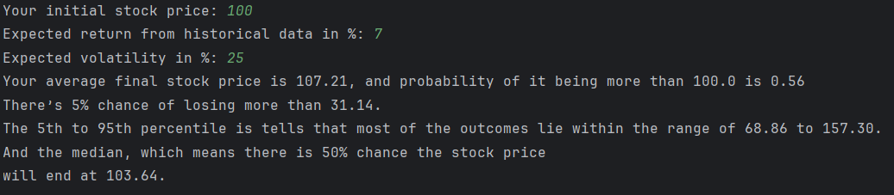
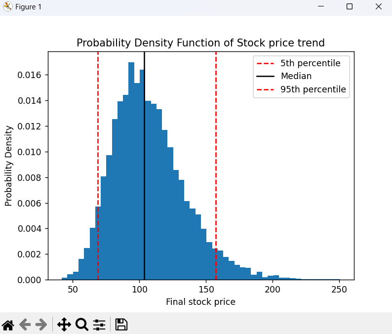

# Monte Carlo Simulation for Stock Price Prediction (Geometric Brownian Motion)

## 📌 Overview

This project uses **Monte Carlo simulation** to model and predict future stock prices based on historical return and volatility. The stock price evolution is simulated using the **Geometric Brownian Motion (GBM)** model, a widely used stochastic process in financial engineering.

The simulation generates thousands of possible price paths over a fixed time horizon and analyzes the statistical distribution of final prices.

The graphs were created using Matplotlib.

## ⚙️ Features

* Simulates stock price paths using stochastic modeling
* Uses Geometric Brownian Motion (GBM)
* Generates 10,000 possible future scenarios
* Visualizes sample price trajectories
* Plots probability density of final stock prices
* Computes probability of profit
* Estimates Value at Risk (VaR) using percentiles

## 🧠 Mathematical Model

The stock price evolution follows the Geometric Brownian Motion equation:

S_{t} = S_{t-1} \cdot e^{\left(\mu - \frac{1}{2}\sigma^2\right)\Delta t + \sigma \sqrt{\Delta t} Z}

Where:

* (S_t) = stock price at time (t)
* (\mu) = expected return
* (\sigma) = volatility
* (Z) = random variable from standard normal distribution
* (\Delta t) = time step

## 🔧 Inputs

* Initial stock price
* Expected return (from historical data)
* Volatility (standard deviation of returns)

## 📊 Outputs

* Average final stock price
* Probability of ending above initial price
* Simulated stock price paths
* Probability density histogram of final prices
* Key percentiles (5th, 50th, 95th)
* Value at Risk (VaR) estimation

## 📈 Visualization methods used

* **Line Plot:** Shows multiple simulated stock price trajectories over time
* **Histogram:** Displays probability density of final stock prices
* **Percentile Markers:** Highlights risk and expected range of outcomes

## 🎯 Key Insights from the project

* Captures uncertainty in financial markets using randomness
* Demonstrates how volatility impacts risk
* Provides probabilistic understanding instead of a single prediction
* Helps estimate downside risk (VaR) and expected returns

## 🚀 Applications

* Financial risk analysis
* Portfolio management
* Option pricing models
* Algorithmic trading research
* Educational demonstrations of stochastic processes

## Preview:

---
## ⚠️ Disclaimer

This simulation is based on assumptions (constant volatility and return) and does not account for real-world complexities such as market shocks, liquidity issues, or macroeconomic factors. It should be used for educational purposes only and not for actual financial decision-making.

## 📝 License

Open-source for educational and research use.
